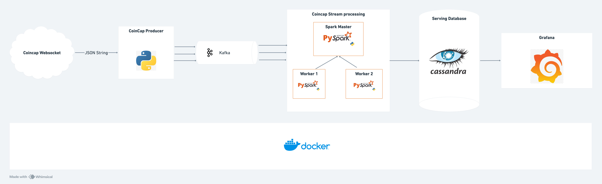
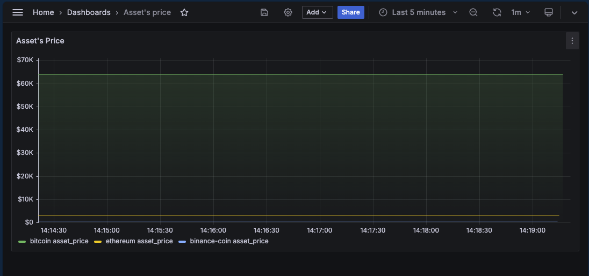
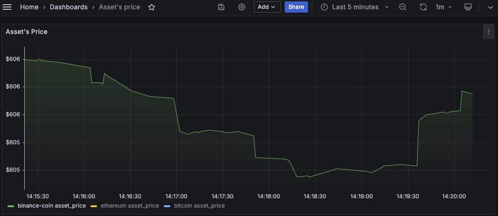
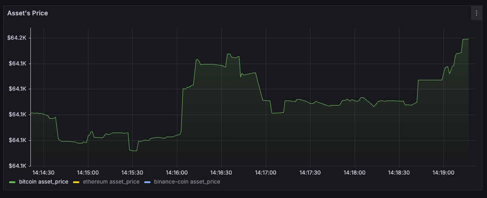
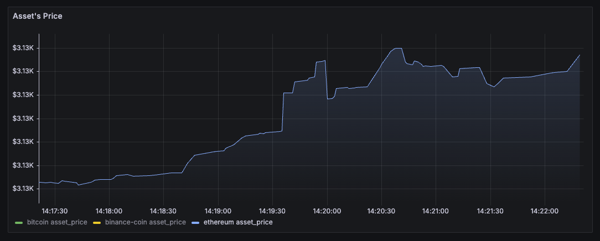

# Coincap Streaming pipeline.

This project demonstrates my expertise in building a streaming data pipeline using Coincap's websocket for real-time cryptocurrency prices and market capitalizations.

[CoinCap API 2.0](https://docs.coincap.io/) is an invaluable tool for accessing real-time pricing and market activity for over 1,000 cryptocurrencies. By aggregating exchange data from thousands of markets, it provides transparent and accurate information on asset prices and availability. The API also offers insights into the specific exchanges and markets that contribute to pricing.

The primary goal is to design a robust streaming data pipeline that ensures low latency, scalability, and availability. This pipeline aims to track and display trends in cryptocurrency prices and market capitalizations.

### Built With

- Containerization - [**Docker**](https://www.docker.com), [**Docker Compose**](https://docs.docker.com/compose/)
- Stream Processing - [**Redpanda**](https://redpanda.com/), [**Spark Streaming**](https://spark.apache.org/docs/latest/streaming-programming-guide.html)
- Data Warehouse - [**Apache Cassandra**](https://cassandra.apache.org/)
- Data Visualization - [**Grafana**](https://grafana.com/)
- Language - [**Python**](https://www.python.org)

## Project Architecture



All applications are containerized into Docker containers.

## Dashboard

### Assets pricing 


### BNB pricing 


### BTC pricing 


### ETH pricing 



## Getting Started

### Prerequisites

1. Install VSCode or [Zed](https://zed.dev/) or any other IDE that works for you.

2. [Install Docker Desktop](https://docs.docker.com/get-docker/)

3. Clone this repository onto your local machine.


### Set up Pipeline

- created an `.env` file.
```
REDPANDA_BROKERS='coincap-redpanda:29092'
ASSET_PRICES_TOPIC=data.asset_prices
```

- Run `docker-compose up` .
- Access the Grafana dashboard by visiting `http://localhost:1244/` in your web browser. 
- Import `./Grafana/dashboard.json` into Grafana to view the dashboard.
